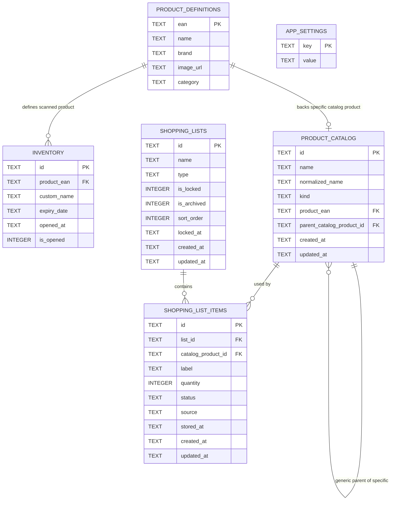

# Schemat bazy danych




## Najwazniejsze relacje

- `inventory.product_ean` wskazuje na `product_definitions.ean`, jesli produkt pochodzi ze skanu.
- `product_catalog.product_ean` wskazuje na `product_definitions.ean` dla produktow konkretnych (`specific`).
- `product_catalog.parent_catalog_product_id` laczy produkt konkretny z produktem ogolnym (`generic`).
- `shopping_list_items.list_id` wskazuje liste zakupow.
- `shopping_list_items.catalog_product_id` jest opcjonalne, bo zwykle pozycje tekstowe nie musza miec wpisu w katalogu.
- `shopping_lists.sort_order` zapisuje reczna kolejnosc list na ekranie list zakupow.
- `app_settings` jest tabela konfiguracyjna i nie ma relacji z pozostalymi tabelami.

## Indeksy

```sql
CREATE UNIQUE INDEX IF NOT EXISTS idx_product_catalog_ean
ON product_catalog(product_ean)
WHERE product_ean IS NOT NULL;

CREATE UNIQUE INDEX IF NOT EXISTS idx_product_catalog_generic_name
ON product_catalog(kind, normalized_name)
WHERE kind = 'generic';

CREATE INDEX IF NOT EXISTS idx_shopping_list_items_list_status
ON shopping_list_items(list_id, status);

CREATE INDEX IF NOT EXISTS idx_shopping_lists_type_locked
ON shopping_lists(type, is_locked);
```
