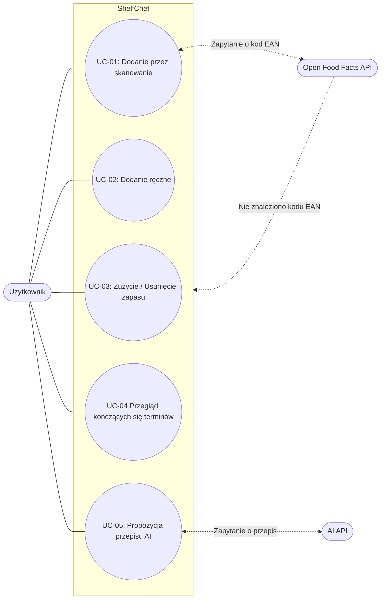

```mermaid
flowchart LR
    User([Uzytkownik])
    OFF_API([Open Food Facts API])
    AI_API([AI API])

    subgraph ShelfChef
        UC1((UC-01: Dodanie przez skanowanie))
        UC2((UC-02: Dodanie ręczne))
        UC3((UC-03: Zużycie / Usunięcie zapasu))
        UC4((UC-04 Przegląd kończących się terminów))
        UC5((UC-05: Propozycja przepisu AI))
    end

    User --- UC1
    User --- UC2
    User --- UC3
    User --- UC4
    User --- UC5

    UC1 <-.-> |Zapytanie o kod EAN| OFF_API
    OFF_API -.-> |Nie znaleziono kodu EAN| ShelfChef
    UC5 <-.-> |Zapytanie o przepis| AI_API
 

```