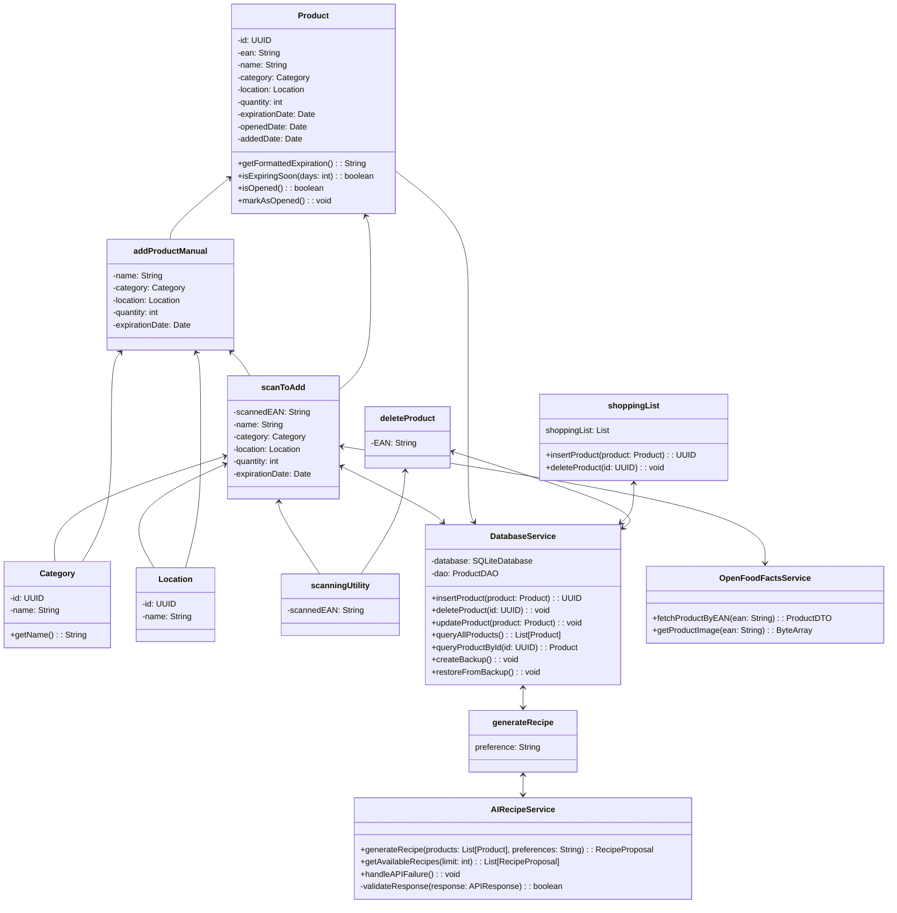

```mermaid
classDiagram
    class Product {
        -id: UUID
        -ean: String
        -name: String
        -category: Category
        -location: Location
        -quantity: int
        -expirationDate: Date
        -openedDate: Date
        -addedDate: Date
        +getFormattedExpiration(): String
        +isExpiringSoon(days: int): boolean
        +isOpened(): boolean
        +markAsOpened(): void
    }
    class Category {
        -id: UUID
        -name: String
        +getName(): String
    }
    class Location {
        -id: UUID
        -name: String
    }
    class scanningUtility {
        -scannedEAN: String
    }
    class scanToAdd {
        -scannedEAN: String
        -name: String
        -category: Category
        -location: Location
        -quantity: int
        -expirationDate: Date
    }
    class DatabaseService {
        -database: SQLiteDatabase
        -dao: ProductDAO
        +insertProduct(product: Product): UUID
        +deleteProduct(id: UUID): void
        +updateProduct(product: Product): void
        +queryAllProducts(): List[Product]
        +queryProductById(id: UUID): Product
        +createBackup(): void
        +restoreFromBackup(): void
    }
    class addProductManual {
        -name: String
        -category: Category
        -location: Location
        -quantity: int
        -expirationDate: Date
    }
    class OpenFoodFactsService {
        +fetchProductByEAN(ean: String): ProductDTO
        +getProductImage(ean: String): ByteArray
    }
    class deleteProduct{
        -EAN: String
    }
    class shoppingList{
        shoppingList: List
        +insertProduct(product: Product): UUID
        +deleteProduct(id: UUID): void
    }
    class generateRecipe{
        preference: String
    }
    class AIRecipeService {
        +generateRecipe(products: List[Product], preferences: String): RecipeProposal
        +getAvailableRecipes(limit: int): List[RecipeProposal]
        +handleAPIFailure(): void
        -validateResponse(response: APIResponse): boolean
    }

    scanToAdd <-- scanningUtility
    scanToAdd <--> DatabaseService
    scanToAdd <--> OpenFoodFactsService
    addProductManual <-- scanToAdd
    Product <-- scanToAdd
    Product <-- addProductManual
    Product --> DatabaseService
    scanToAdd <-- Category
    scanToAdd <-- Location
    addProductManual <-- Category
    addProductManual <-- Location
    shoppingList <--> DatabaseService
    DatabaseService <--> generateRecipe
    generateRecipe <--> AIRecipeService
    deleteProduct <--> DatabaseService
    deleteProduct <-- scanningUtility


```