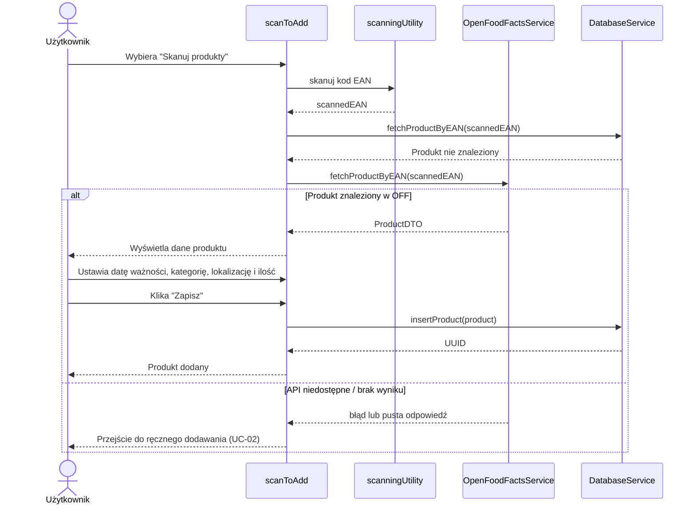
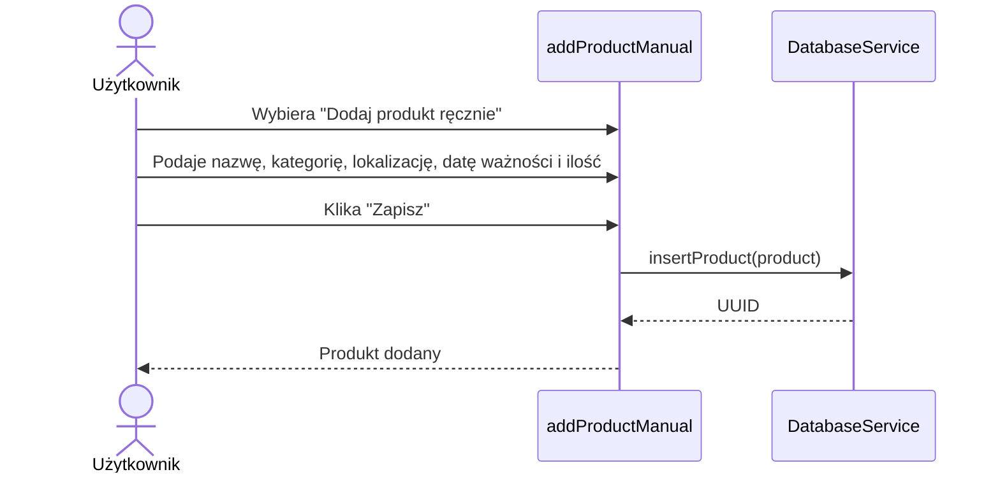
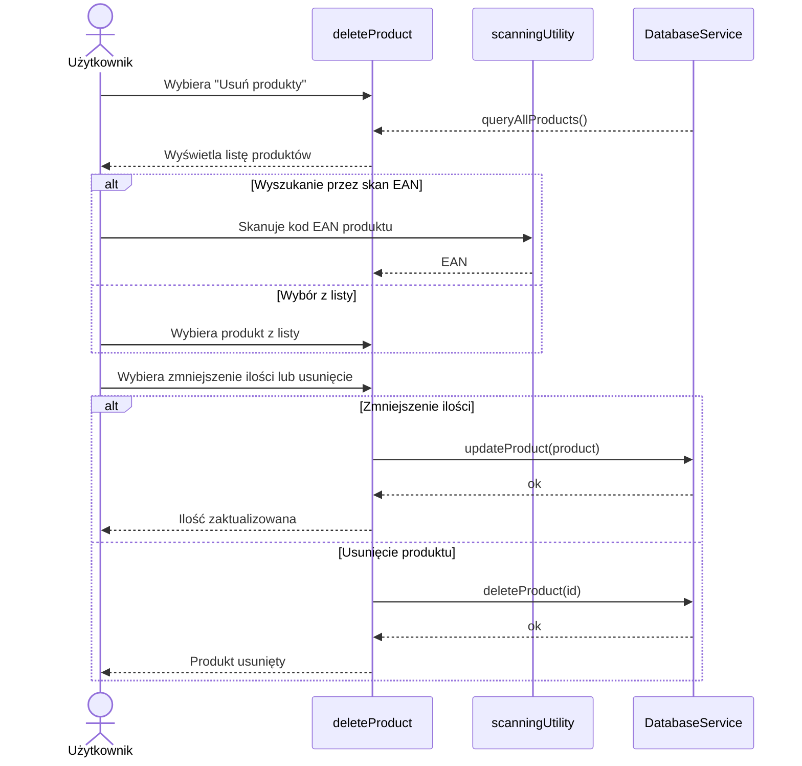
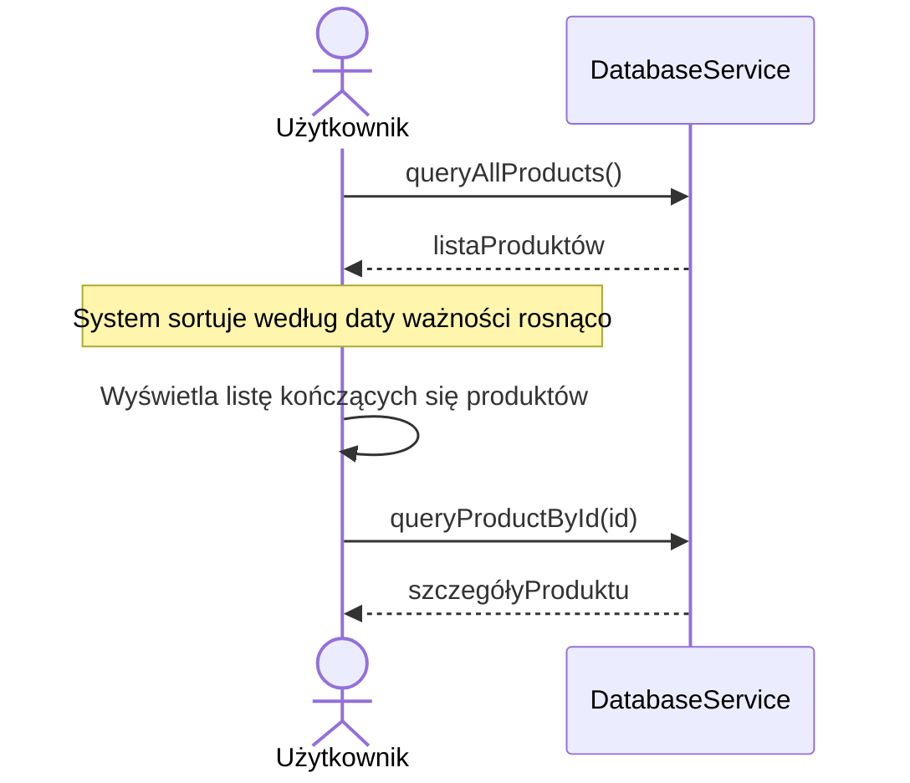
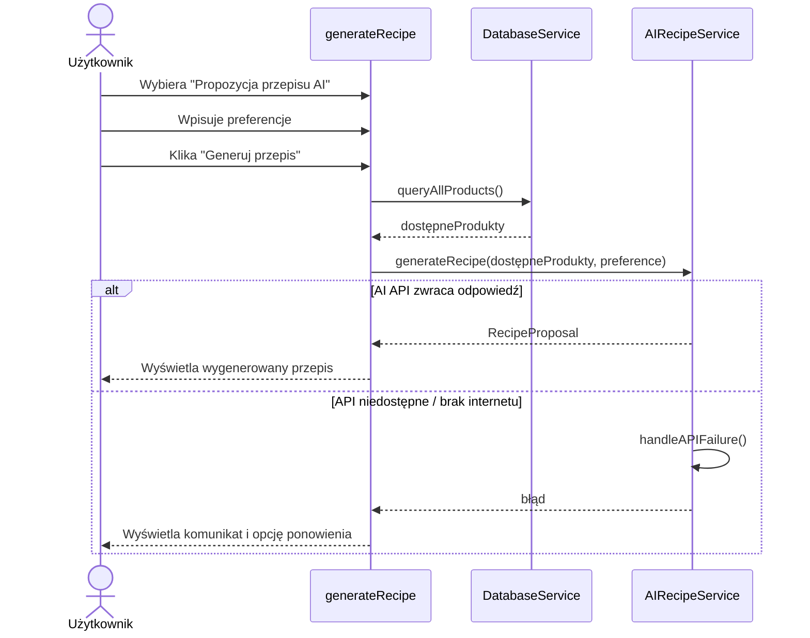
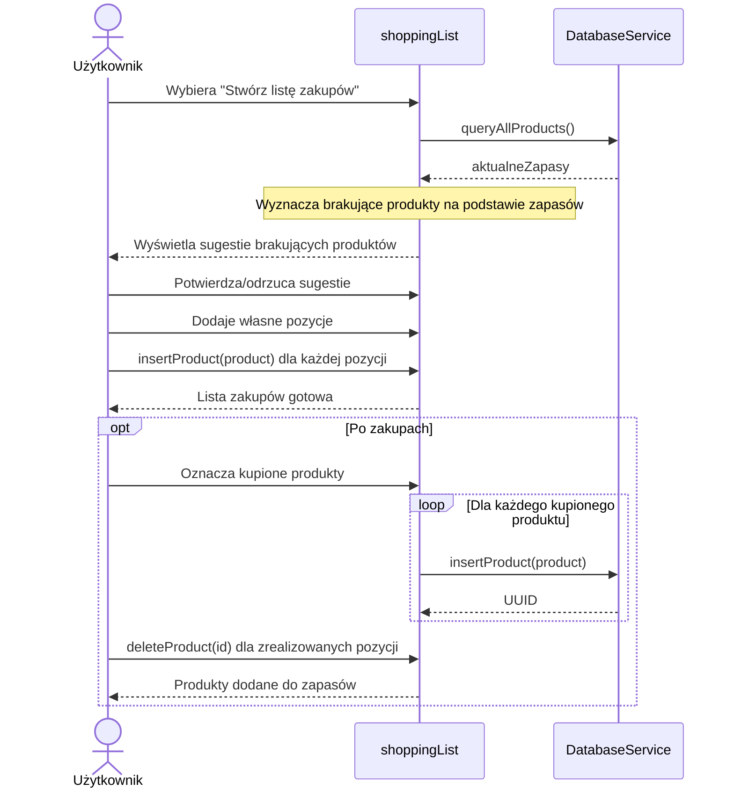

# Diagramy sekwencji

## UC-01: Dodanie produktu przez skanowanie kodu kreskowego

## UC-02: Ręczne dodanie produktu

## UC-03: Zużycie / usunięcie produktu

## UC-04: Przegląd kończących się terminów

## UC-05: Propozycja przepisu AI

## UC-06: Generowanie listy zakupów

